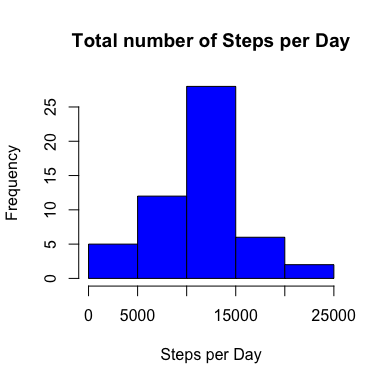
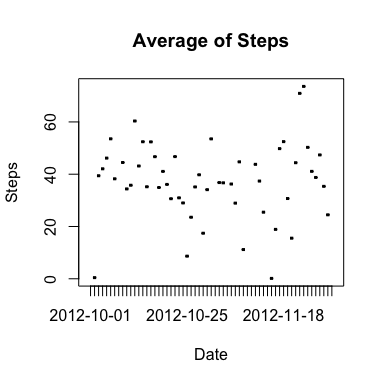
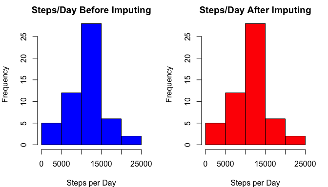
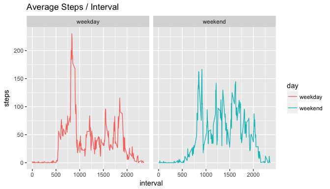

# Reproducible Researach - Project 1
Lisa Wang  


###Introduction
This assignment makes use of data from a personal activity monitoring device. This device collects data at 5 minute intervals through out the day. The data consists of two months of data from an anonymous individual collected during the months of October and November, 2012 and include the number of steps taken in 5 minute intervals each day.

###Apply analystic methods on orignal dataset
Loading data into R

```r
if (!file.exists("activity.csv")) {
	print("Please download activity.csv file into your working directory")
	return
}
db <- read.csv("activity.csv")
```

Generate histogram of the total number of steps taken each day

```r
daySum<-aggregate(steps ~ date, data=db, sum)
hist(daySum$steps, col="blue", main="Total number of Steps per Day", 
xlab="Steps per Day")
```

<!-- -->

Calculate mean and median number of steps taken each day

```r
mean(daySum$steps)
```

```
## [1] 10766.19
```

```r
median(daySum$steps)
```

```
## [1] 10765
```

Time series plot of the average number of steps taken

```r
dayMean<-aggregate(steps ~ date, data=db, mean)
plot(dayMean$date, dayMean$steps, type="l", main="Average of Steps", xlab="Date", ylab="Steps")
```

<!-- -->

The 5-minute interval that, on average, contains the maximum number of steps

```r
intervalSum<-aggregate(steps ~ interval, data=db, mean)
max(intervalSum)
```

```
## [1] 2355
```
###Impute missing data 
Calculate the total number of missing values

```r
missing<-is.na(db$steps)
sum(missing)
```

```
## [1] 2304
```

Using the average of each interval value to replace the missing value, and create a new dataset that is equal to the original dataset but with the missing data filled in

```r
imputed <- db
imputed$steps[missing]<-intervalSum[imputed$interval==intervalSum,]$steps
```

Make a histogram of the total number of steps taken each day compare with the orginal dataset histogram side by side

```r
dayImp<-aggregate(steps ~ date, data=db, sum)
par(mfrow=c(1,2), mar=c(4,4,2,2))
hist(daySum$steps, col="blue", main="Steps/Day Before Imputing", 
xlab="Steps per Day")
hist(dayImp$steps, col="red", main="Steps/Day After Imputing", 
xlab="Steps per Day")
```

<!-- -->

Calculate and report the mean and median total number of steps taken per day on the new imputed dataset

```r
mean(dayImp$steps)
```

```
## [1] 10766.19
```

```r
median(dayImp$steps)
```

```
## [1] 10765
```

### A dataset with a new varilabe
Import day variable of ("weekday", "weekend") into the dayImp dataset

```r
day<-factor(1:2, labels = c("weekday", "weekend"))
imputed$day<-day[(weekdays(as.Date(imputed$date,"%Y-%m-%d")) %in% c("Saturday", "Sunday"))+1]
```

The 5-minute interval and the average number of steps taken, averaged across all weekday days or weekend days

```r
intervalImp<-aggregate(steps ~ interval+day, data=imputed, mean)
qplot(interval, steps, data=intervalImp, main="Average Steps / Interval", geom="line", color=day,facets= .~day)
```

<!-- -->


